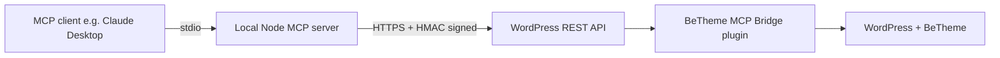

# BeTheme MCP Server

A secure, agent-friendly MCP server that turns one or more BeTheme-powered WordPress sites into a backend-equivalent environment for an AI agent.

```text
┌──────────────────────────────────────────────────────────────┐
│  BeTheme MCP Server                                          │
│  Agent-driven WordPress + BeTheme administration             │
│  Pages • Templates • Plugins • WooCommerce • BeBuilder       │
└──────────────────────────────────────────────────────────────┘
```

## What this project does

This project lets an AI agent manage BeTheme-powered WordPress sites without logging into wp-admin. It exposes MCP tools for:

- creating, editing, publishing, and deleting pages
- reading and writing BeBuilder payloads (`mfn-page-items`)
- creating and updating BeTheme templates (headers, footers, archives, popups, etc.)
- listing, activating, deactivating, and installing plugins
- returning site context and capabilities so the agent knows what it can do

The design is built for agencies: one local MCP server can connect to many client sites, each with its own URL and API key.

## Architecture — what runs where

The project has two parts. Almost all business logic lives in the WordPress plugin. The local Node process is only a thin protocol adapter between the MCP client and the REST bridge.



### Part 1 — WordPress bridge plugin (`plugin/betheme-mcp-bridge.php`)

This runs on the web server inside WordPress. It:

- registers REST routes under `/wp-json/betheme-mcp/v1/`
- authenticates every request with an API key + HMAC-SHA256 request signature
- enforces WordPress capability checks (`edit_pages`, `edit_theme_options`, `activate_plugins`, etc.)
- sanitizes input, allow-lists BeTheme meta keys, and stores builder payloads in BeTheme's native format
- audits every action through the `betheme_mcp_audit` hook
- applies per-key rate limiting

### Part 2 — Local MCP server (`src/server.js`)

This is a small Node.js process that runs on the machine where the AI agent runs. It:

- speaks the MCP protocol over stdin/stdout
- validates tool arguments against the declared JSON schema
- routes each tool call to the correct WordPress bridge endpoint
- supports multiple sites through a `site` argument or per-site configuration

### Why does the MCP server run locally?

MCP clients today (Claude Desktop, etc.) usually launch an MCP server as a local child process over stdio. That local process can then talk to remote APIs. We keep the local part as thin as possible: it has no WordPress business logic, no database access, and no plugin installation logic. If your MCP client supports SSE, you can also host the Node server on your own infrastructure and point the client at it.

## Installation — single site

### 1. WordPress requirements

- WordPress 6.4+ with the BeTheme theme active
- PHP 8.2+
- HTTPS recommended in production

### 2. Install the bridge plugin

1. Copy `plugin/betheme-mcp-bridge.php` into your WordPress site's `wp-content/plugins/` directory.
2. In wp-admin, go to **Plugins** and activate **BeTheme MCP Bridge**.
3. Open `wp-config.php` and add a secure API key:

   ```php
   define('BETHEME_MCP_API_KEY', 'replace-with-a-long-random-key');
   ```

4. Optional but recommended policy flags:

   ```php
   define('BETHEME_MCP_AUDIT_LOG', true);
   define('BETHEME_MCP_ALLOW_PLUGIN_INSTALL', false);
   ```

5. Verify the bridge is reachable:

   ```bash
   curl -H "X-API-Key: replace-with-a-long-random-key" \
        https://your-site.test/wp-json/betheme-mcp/v1/health
   ```

   You should get `{"ok":true,"site":"..."}`.

### 3. Install and run the local MCP server

1. Clone this repository on the machine where your AI agent runs:

   ```bash
   git clone <repo-url> betheme-mcp
   cd betheme-mcp
   npm install
   ```

2. Create the environment file:

   ```bash
   cp .env.example .env
   ```

3. Edit `.env`:

   ```text
   BETHEME_MCP_API_KEY=replace-with-a-long-random-key
   BETHEME_MCP_BASE_URL=https://your-site.test
   BETHEME_MCP_TIMEOUT_MS=10000
   ```

4. Start the server:

   ```bash
   npm start
   ```

5. Verify with the demo harness:

   ```bash
   npm run demo
   ```

### 4. Connect your MCP client

Pick the client you use and add the server configuration. In every case the local Node process is the same; only the client's config file or settings change.

#### Claude Desktop

Edit `claude_desktop_config.json`:

- macOS: `~/Library/Application Support/Claude/claude_desktop_config.json`
- Windows: `%APPDATA%\Claude\claude_desktop_config.json`
- Linux: `~/.config/Claude/claude_desktop_config.json`

```json
{
  "mcpServers": {
    "betheme": {
      "command": "node",
      "args": ["/absolute/path/to/betheme-mcp/src/server.js"]
    }
  }
}
```

#### ChatGPT Desktop

OpenAI's ChatGPT Desktop does not currently support local MCP servers. If support is added, the configuration file is expected to use the same `mcpServers` format as Claude Desktop. Use the same JSON structure and check OpenAI's documentation for the exact file location.

#### Copilot via VS Code

VS Code's Copilot Chat can use MCP servers configured in your user settings. Open **Settings (JSON)** (`Cmd/Ctrl + Shift + P` → **Preferences: Open User Settings (JSON)**) and add:

```json
{
  "chat.mcp.servers": {
    "betheme": {
      "command": "node",
      "args": ["/absolute/path/to/betheme-mcp/src/server.js"]
    }
  }
}
```

The exact setting name may vary across VS Code versions (`chat.mcp.servers`, `chat.mcp.serverDefinitions`, or `github.copilot.chat.mcpServers`). If one setting is not recognized, try the next or check the latest VS Code MCP documentation.

#### GitHub Copilot Desktop

There is currently no standalone "GitHub Copilot Desktop" application that exposes local MCP server configuration. Use **Copilot via VS Code** above, or use Copilot in any editor that supports MCP server settings.

After saving the configuration, restart the client. The agent can now call tools such as `list_pages`, `create_page`, `save_page_builder_payload`, and `list_plugins`.

## Installation — multi-site (agency setup)

Agencies can manage many client sites from one local MCP server. There are two ways to configure multiple sites.

### Option A: `sites.json` file (recommended)

1. Copy the example file:

   ```bash
   cp sites.json.example sites.json
   ```

2. Edit `sites.json`:

   ```json
   [
     {
       "name": "client-a",
       "baseUrl": "https://client-a.test",
       "apiKey": "key-for-client-a",
       "timeoutMs": 10000
     },
     {
       "name": "client-b",
       "baseUrl": "https://client-b.test",
       "apiKey": "key-for-client-b",
       "timeoutMs": 10000
     }
   ]
   ```

3. Restart `npm start`.

### Option B: environment variable

In `.env`, set a single JSON array:

```text
BETHEME_MCP_SITES=[{"name":"client-a","baseUrl":"https://client-a.test","apiKey":"key-for-client-a"},{"name":"client-b","baseUrl":"https://client-b.test","apiKey":"key-for-client-b"}]
```

`BETHEME_MCP_SITES` overrides `sites.json`. The single-site variables are ignored when multi-site configuration is present.

### Using multiple sites in conversation

The agent can list configured sites with `list_sites`. For any other tool, pass the `site` argument:

- `list_pages` → lists pages from the first/default site
- `list_pages` with `{"site":"client-a"}` → lists pages from client-a
- `create_page` with `{"title":"Home","site":"client-b"}` → creates a page on client-b

If `site` is omitted, the first site in the configuration is used.

### Multiple sites from the agent's point of view

You can tell the agent:

> "List the sites you can access, then create a homepage on `client-a` and a contact page on `client-b`."

The agent will call `list_sites`, pick the correct aliases, and route each action to the right WordPress installation.

## How authentication works

Every request from the local MCP server to WordPress is authenticated in two ways:

1. **API key** — sent in the `X-API-Key` header and compared against `BETHEME_MCP_API_KEY` in wp-config.php.
2. **HMAC request signature** — the local server signs the request with `HMAC-SHA256(method|timestamp|body)` and sends it in `X-Request-Signature`. The bridge rejects requests outside a 5-minute replay window or with an invalid signature.

Keep the API key secret. Use HTTPS in production so the key and signatures are protected in transit.

## Capability model

The bridge checks WordPress capabilities on every route:

| Operation | Capability required |
|-----------|---------------------|
| Read pages | `edit_pages` |
| Create pages | `publish_pages` |
| Update pages | `edit_pages` (or `edit_others_pages` for other authors) |
| Delete pages | `delete_pages` (or `delete_others_pages`) |
| Templates | `edit_theme_options` |
| List/activate/deactivate plugins | `activate_plugins` |
| Install plugins | `install_plugins` AND `BETHEME_MCP_ALLOW_PLUGIN_INSTALL` must be `true` |

The `authenticate` tool returns the bridge-level capabilities the current context supports.

## Security model

- **Authentication**: API key + HMAC-SHA256 request signing with timestamp replay window.
- **Authorization**: per-route WordPress capability checks.
- **Input validation**: JSON Schema validation on the MCP side; sanitization and allow-lists on the PHP side.
- **Meta allow-listing**: only known BeTheme page/template meta keys are accepted.
- **Payload hardening**: builder payloads are stored in BeTheme's native format and capped at 1 MB.
- **Rate limiting**: per-API-key token bucket using WordPress transients.
- **Audit logging**: every administrative action is logged via `betheme_mcp_audit` and optionally to the PHP error log.

## Development and testing

Run the local test and lint suite:

```bash
npm test
npm run lint
php -l plugin/betheme-mcp-bridge.php
```

All three should pass before any release.

## Documentation

- [docs/README.md](docs/README.md) — documentation index
- [docs/sdd/02-architecture.md](docs/sdd/02-architecture.md) — system architecture
- [docs/sdd/07-mcp-capability-surface.md](docs/sdd/07-mcp-capability-surface.md) — MCP tools, resources, and prompts
- [docs/sdd/06-security-and-owasp.md](docs/sdd/06-security-and-owasp.md) — security posture

## Release and versioning

Releases are published through GitHub Actions when a `v*` tag is pushed. Version numbers align with the BeTheme version they target, plus an alpha suffix. The current alpha is `28.5.4-alpha.003`.

## Alpha release notice

This project is currently an alpha release and is still under quality assurance. It is intended for evaluation, integration testing, and controlled internal use, not for production deployment until QA is complete.
